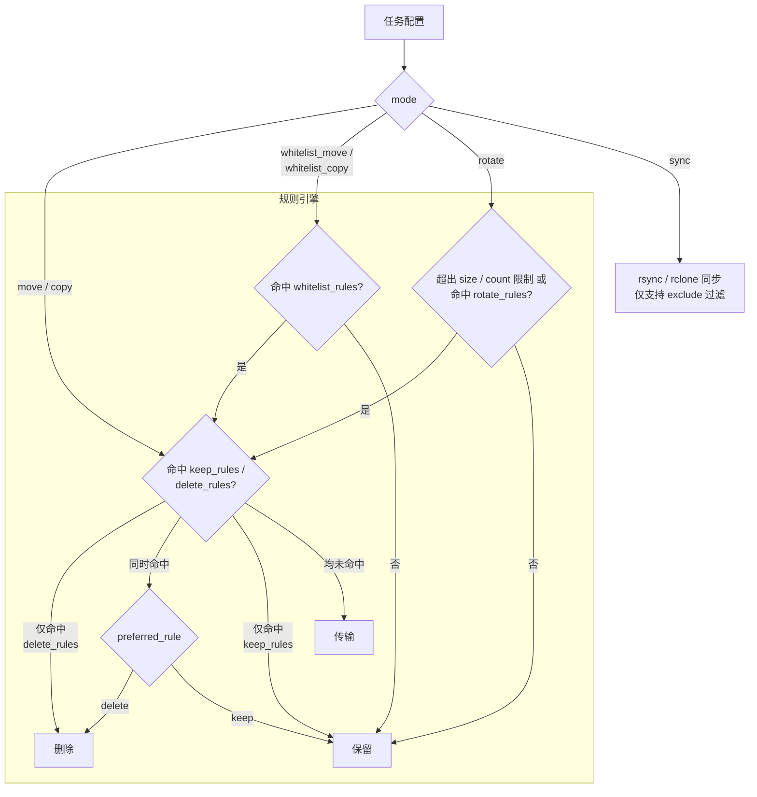

# SmartArchiver

SmartArchiver 是一个灵活的文件归档与清理工具，帮助你按规则自动管理磁盘上的文件——将旧文件移动到归档目录、清理过期日志、按条件轮转文件、或保持两个目录的镜像同步。

📝 [更新日志](./CHANGELOG.md) | 📋 [TODO 看板](./ROADMAP.md)

---

## 适用场景

SmartArchiver 解决的核心问题是：**"磁盘上有一堆文件，我想根据名字、大小、时间等条件，把它们搬运、删除或同步到别处"**。它既可作为一次性脚本，也可作为常驻服务定时运行。以下是几个典型场景：

- **冷热数据分层**：将 SSD 上超过 N 天未修改的文件自动迁移到 HDD 大容量存储，同时保留最近文件在高速盘上。
- **日志归档与清理**：将 `logs/` 目录下超过一定天数的大日志文件移动到归档目录；或当日志总体积超过阈值时，从最旧的开始轮转删除。
- **备份目录瘦身**：在备份目录中保留最近 N 份全量备份或限制总大小，超出部分自动清除。
- **选择性同步**：将源目录镜像同步到目标，但排除临时文件、缓存目录等不需要同步的内容。
- **白名单模式**：仅处理符合特定命名规则的文件（如只搬运 `*.mp4`），其他一律不动。
- **定时自动运行**：通过 cron 表达式或固定间隔，让程序在后台持续执行上述任务。
- **跨主机远程操作**：将文件归档到另一台主机（HTTP 远端），或通过 SSH 将目录镜像同步到远端服务器。

---

## 安装与部署

### 本地运行（客户端）

需要 Python 3.11+（内置 `tomllib`，无需额外安装 TOML 解析库）。

```bash
# 1. 克隆项目
git clone https://github.com/hexstan/smart-archiver.git
cd smart-archiver

# 2. 安装依赖
pip install -r requirements.txt

# 3. 创建并编辑配置文件
cp config/config.example.toml config/config.toml
# 按需编辑 config/config.toml，参考示例文件中的注释

# 4. 一次性运行（客户端模式）
python main.py
```

如需使用同步（sync）模式：
- **Linux**：需安装 `rsync`（`apt install rsync` / `yum install rsync`）
- **Windows**：需安装 [`rclone`](https://rclone.org/downloads/) 并将其加入 PATH
- 可通过 `tool` 配置项强制指定工具（`"rsync"` 或 `"rclone"`）

### 服务器模式（HTTP Server）

SmartArchiver 可作为 HTTP 服务器运行，接受来自其他客户端实例的远程文件操作请求。

```bash
# 1. 创建服务器配置文件
cp config/config.server.example.toml config/config.server.toml
# 编辑 api_key（API 认证密钥）、port（监听端口）等参数

# 2. 启动服务器
python main.py --server
```

服务器提供两个 API 端点：`POST /api/remote`（元数据操作）和 `POST /api/remote/upload`（文件上传），支持并发控制和排队机制。详细配置见 `config/config.server.example.toml`。

### Docker 部署（推荐）

项目为三种角色提供了独立的镜像：**客户端**、**HTTP 服务器**和 **SSH 远端服务器**。

#### 客户端 / HTTP 服务器镜像

应用镜像基于 `python:3.14-slim-trixie`，已内置 `rsync`。GitHub Actions 自动构建 `linux/amd64` 和 `linux/arm64` 多架构镜像，发布到 `ghcr.io/hexstan/smart-archiver`。

```bash
# 1. 创建并编辑配置文件
cp config/config.example.toml config/config.toml

# 2. 按需编辑 docker-compose.yml 中的目录挂载映射

# 3. 启动客户端容器
docker-compose up -d

# 查看日志
docker-compose logs -f
```

`docker-compose.yml` 中预置了三种服务，按需取消注释即可启用：
- **client**（默认启用）：运行客户端任务
- **server**（已注释）：运行 HTTP 服务器，需配合 `command: ["--server"]` 和 `config.server.toml`
- **ssh-server**（已注释）：SSH 远端目标，供 sync 模式使用

也可直接构建镜像（注意 Dockerfile 路径）：

```bash
docker build -f docker/app/Dockerfile -t smart-archiver .
docker run -d \
  --name smart-archiver \
  --restart unless-stopped \
  -v $(pwd)/config:/app/config \
  -v $(pwd)/logs:/app/logs \
  -v /your/source:/app/source \
  -v /your/dest:/app/dest \
  smart-archiver
```

#### SSH 远端服务器镜像

为 SSH 同步模式提供即用的远端目标容器（Alpine + OpenSSH + rsync）。镜像发布到 `ghcr.io/hexstan/sa-ssh-server`。

```bash
# 在远端主机上运行
docker run -d \
  --name sa-ssh-server \
  --restart unless-stopped \
  -p 2222:22 \
  -e ROOT_PASSWORD=your_password \
  -v /path/to/data:/data \
  ghcr.io/hexstan/sa-ssh-server:latest

# 或使用密钥认证
docker run -d \
  --name sa-ssh-server \
  --restart unless-stopped \
  -p 2222:22 \
  -e AUTHORIZED_KEYS="ssh-rsa AAAA..." \
  -v /path/to/data:/data \
  ghcr.io/hexstan/sa-ssh-server:latest
```

容器启动时自动生成 SSH 主机密钥，支持密码和公钥两种认证方式（通过 `ROOT_PASSWORD` 和 `AUTHORIZED_KEYS` 环境变量配置）。

---

## 配置向导

本章以**决策树**的方式引导你完成 `config.toml` 的编写：先明确目标，再选择模式和参数，最后按需叠加规则和远程目标。

---

### 第一步：明确你的目标

SmartArchiver 的核心能力是**对源目录中的文件执行某种操作**。根据你想做的事，选择对应的任务模式（`mode`）：

| 我想做什么 | 应选模式 | 关键词 |
|-----------|---------|--------|
| 把文件批量搬运到另一个目录 | `move` | 移动、归档、冷热分层 |
| 把文件批量复制到另一个目录 | `copy` | 复制、备份、多副本 |
| **只**搬运命中特定命名规则的文件 | `whitelist_move` | 白名单、选择性搬运 |
| **只**复制命中特定命名规则的文件 | `whitelist_copy` | 白名单、选择性复制 |
| 限制目录体积/数量，超出部分自动清理 | `rotate` | 轮转、限额、清理 |
| 让两个目录保持完全一致（镜像同步） | `sync` | 同步、镜像、rsync |

**决策要点**：

- 如果源目录文件**各式各样**，但你只想动其中某几类 → 选 `whitelist_move` 或 `whitelist_copy`
- 如果目标是**"目录不能超过某个大小"**而非"移动具体哪个文件" → 选 `rotate`
- 如果源和目标需要**时刻保持一致**，且不关心单文件粒度规则 → 选 `sync`
- 其余常规归档/备份需求 → 选 `move` 或 `copy`

---

### 第二步：填写基础参数

确定模式后，每个任务需要填写以下必填字段。参数是否必须取决于所选模式——下表中 `✓` 表示必填，`○` 表示选填，`✗` 表示该模式不支持此参数。

#### 通用参数

| 参数 | move | copy | whitelist_move | whitelist_copy | rotate | sync | 说明 |
|------|:----:|:----:|:--------------:|:--------------:|:------:|:----:|------|
| `name` | ○ | ○ | ○ | ○ | ○ | ○ | 任务名称，仅用于日志展示 |
| `source` | ✓ | ✓ | ✓ | ✓ | ✓ | ✓ | 源目录路径 |
| `dest` | ○ | ○ | ○ | ○ | ○ | ✓ | 目标目录路径（仅 sync 模式必填） |
| `conflict_policy` | ○ | ○ | ○ | ○ | ✗ | ✗ | 同名文件冲突策略（默认 `"skip"`） |
| `remove_empty_dirs` | ✓ | ✓ | ✓ | ✓ | ✓ | ✗ | 任务结束后是否清理空目录 |
| `mtime_threshold_minutes` | ✓ | ✓ | ✓ | ✓ | ✗ | ✗ | 修改时间阈值（分钟） |

#### 模式专属参数

| 参数 | 适用模式 | 说明 |
|------|---------|------|
| `size_limit` | rotate | 全局目录总体积上限，如 `"1GB"`，`0` 表示不限制 |
| `count_limit` | rotate | 全局目录文件总数量上限，`0` 表示不限制 |
| `tool` | sync | 同步工具：`"auto"`（自动）、`"rsync"`、`"rclone"` |
| `exclude` | sync | 排除模式列表，由底层工具处理 |
| `create_backups` | sync | 替换/删除前是否备份，默认 `false` |
| `max_backups` | sync | 最多保留备份份数，`0` 表示不限制 |

---

#### 参数详解

**`conflict_policy`**（move / copy / whitelist 模式选填，默认 `"skip"`）：

当目标位置已存在同名文件时的处理策略：

- `"overwrite"` — 覆盖目标文件
- `"skip"` — 跳过该文件，不传输
- `"copy"` — 创建带编号的副本，如 `file.txt` → `file-1.txt`。「copy」在此处指「保留两份」，不是指任务模式为复制

**`mtime_threshold_minutes`**（move / copy / whitelist 模式必填）：

文件最近修改时间需超过该阈值（分钟）才会被处理。**该阈值同时约束传输和删除**——即便是被 `delete_rules` 匹配的文件，如果其 mtime 不满足阈值也不会被删除。建议至少设为几分钟，避免处理仍在写入的文件。

设为 `0` 表示无时间限制，所有文件立即参与处理。

**轮转模式（rotate）不需要此参数**。轮转按文件 mtime 升序处理（最旧的优先），新文件天然排在后面。

**`remove_empty_dirs`**（move / copy / whitelist / rotate 模式）：

任务结束后自底向上清理源目录中的空目录。清理时会跳过符号链接和挂载点，不会意外卸载外部存储。

**rotate 模式的限制条件**（`size_limit` / `count_limit` / `rotate_rules`）：

至少配置一项，程序才会执行。如果所有限制都未触发，任务会直接跳过。

**sync 模式的 `tool` 选择**：

- `"auto"`（默认）：Windows 上自动使用 rclone，Linux/macOS 上自动使用 rsync
- `"rsync"`：强制使用 rsync（需预装，Linux/macOS 通常自带）
- `"rclone"`：强制使用 rclone（需预装，[下载地址](https://rclone.org/downloads/)）

---

#### 最小配置示例

以下是三种典型模式的最简配置——去掉所有可选字段，只保留启动任务所需的最低限度：

**move / copy 最小配置**：

```toml
[[tasks]]
mode = "move"
source = "./my_files"
dest = "./archive"
mtime_threshold_minutes = 1440    # 1 天
remove_empty_dirs = false
```

**rotate 最小配置**（仅全局体积限制）：

```toml
[[tasks]]
mode = "rotate"
source = "./logs"
size_limit = "500MB"
remove_empty_dirs = false
```

**sync 最小配置**：

```toml
[[tasks]]
mode = "sync"
source = "./data"
dest = "./mirror"
```

---

### 第三步：用规则精确筛选（move / copy / whitelist / rotate 模式）

如果基础参数不能满足你的需求——比如"只移动大于 100MB 的文件"、"删除所有 .tmp 但保护 .important.tmp"——你需要配置**规则**。

> ⚠️ sync 模式不支持规则系统，所有过滤通过 `exclude` 参数实现。

#### 规则系统流程一览



#### 规则语法

每组规则内部按阈值方向分为两个子表：

- **`lt`（less than）**：当目标大小**小于**阈值时命中
- **`ge`（greater or equal）**：当目标大小**大于等于**阈值时命中

每个键值对是一条规则：`lt|ge."模式" = 阈值`。模式支持通配符 `*`（匹配任意字符）和 `?`（匹配单个字符）。

阈值可以是大小字符串（`"10MB"`、`"1GB"`、`"500KB"`）或特殊值 `-1`（匹配所有大小，不受大小限制）。

**区分文件和目录**：模式末尾带 `/` 匹配目录，不带 `/` 匹配文件。

```toml
[tasks.keep_rules]
# 文件规则（模式末尾无 /）：
lt."*.log" = "10MB"              # 小于 10MB 的 .log 文件 → 保留
ge."backup.iso" = -1              # 所有 backup.iso 文件 → 保留（-1 无条件命中）

# 目录规则（模式末尾有 /）：
lt."cache/" = "500MB"             # 小于 500MB 的 cache 目录 → 保留
ge."backups/" = "1GB"             # 大于等于 1GB 的 backups 目录 → 删除
```

#### 多级路径匹配

模式可包含 `/` 来匹配嵌套路径（规则引擎接收的是相对源目录的路径）：

```toml
lt."logs/*.log" = "100MB"         # logs/ 下所有 .log 文件
lt."data/*/cache/" = "50MB"       # data/ 下一级子目录中的 cache/ 目录
ge."alpha/beta/charlie.txt" = -1  # 精确路径匹配
```

> ⚠️ 规则匹配的是**相对于源目录的路径**。例如源目录为 `./source`，文件为 `./source/a/b/file.txt`，编写规则时应使用 `"a/b/file.txt"` 或 `"*/*/file.txt"`。

**单级模式**（不含 `/` 的模式）只匹配文件名的最后一部分，例如 `"*.log"` 可匹配任意深度的 `.log` 文件。

#### 规则决策流程

当 `FileFilterPolicy` 评估一个文件/目录时，按以下顺序决策：

1. **检查 keep_rules**：命中 → `FileAction.SKIP`（保留）
2. **检查 delete_rules**：命中 → `FileAction.DELETE`
3. **同时命中 keep 和 delete**：由 `preferred_rule` 决定：
   - `"keep"`（默认）→ 保留
   - `"delete"` → 删除
4. **白名单模式**：未命中 whitelist_rules → 跳过（其父目录若命中则继承白名单状态）
5. **都不命中** → 正常传输（`FileAction.TRANSFER`）

> ℹ️ 配置示例：要删除所有 .tmp 文件但保护 important.tmp：
> ```toml
> keep_rules.ge."important.tmp" = -1
> delete_rules.ge."*.tmp" = -1
> preferred_rule = "keep"   # 默认值，可省略
> ```
> 这里 `important.tmp` 同时命中 keep（精确匹配）和 delete（被 `*.tmp` 通配），但 `preferred_rule = "keep"` 使保留规则优先。如果改为 `preferred_rule = "delete"`，则 `important.tmp` 也会被删除。

#### `preferred_rule` 的正确用法

将 `preferred_rule` 设为 `"delete"` 的典型场景是**宁可错杀不可放过**——当一个文件同时符合保留条件和删除条件时，你选择删除。很少有人需要这样配置。大多数情况下保持默认的 `"keep"` 即可。

#### 惰性求值

规则引擎在检查规则时尽可能避免计算目录大小（递归扫描开销大）：

1. 先做名称匹配（字符串比较，极快）
2. 如果命中 `ge."模式" = -1`，直接返回命中，**不计算大小**
3. 只有名称匹配且阈值非 -1 时才实际计算大小

利用这一点，将无条件命中的规则写为 `ge."模式" = -1` 可以提升性能。

#### 白名单模式的特殊行为

在白名单模式下，**只有命中 `whitelist_rules` 的文件/目录才会被处理**。未命中的直接跳过。

**父目录继承**：如果一个目录命中白名单，该目录下的所有子文件和子目录自动继承白名单状态——即使它们自身的名称不匹配任何白名单规则。这意味着：
- 配置 `whitelist_rules.ge."videos/" = -1` 会将 `videos/` 下所有内容纳入处理范围
- 你不需要为 `videos/` 下的每个子目录单独配置白名单

**白名单与 keep/delete 的关系**：白名单先过滤，keep/delete 再对通过白名单的项做二次判断。你可以在白名单限定的范围内再用 keep/delete 做更精细的控制。

#### 轮转模式中的规则

轮转模式会先扫描所有文件建立分组统计，然后从最旧的文件开始逐个处理（移动或删除），直到所有分组都不再超限。在决定具体如何处理一个文件时，规则系统才会介入：

- 命中 `keep_rules` → 跳过，该文件留在原地，其统计值也保留（不会从分组中扣除）
- 命中 `delete_rules` → 直接删除，不移动到 dest
- 都不命中 → 若有 dest 则移动，若无 dest 则跳过（留在原地）

**典型用法**：
- 纯清理：`delete_rules.ge."*" = -1`，无需配置 dest，所有轮转产生的文件直接删除
- 选择性保护：`keep_rules.ge."*.important" = -1`，某些重要文件即使超限也不会被轮转处理

**`rotate_rules` 不支持匹配目录**：`rotate_rules` 的 pattern 不能以 `/` 结尾。要限制某个目录下的文件，用 `"目录名/*"` 而非 `"目录名/"`。

**`rotate_rules` 的全局限制与规则限制**：全局 `size_limit` / `count_limit` 对所有文件生效，规则级限制只对匹配特定模式的文件生效。一个文件可能同时属于全局组和多个规则组——只要任一关联分组超限，该文件就会被处理。处理完成后会从所有关联分组中扣除该文件的统计值。

**轮转停止条件**：一旦所有分组（全局 + 规则级）都不再超限，轮转立即停止。已无可处理文件但仍有分组超限时，会输出警告日志。

---

### 第四步：配置远程目标（可选）

如果 `dest` 不是本地路径，你需要配置远程目标后端。SmartArchiver 支持三种后端：

| 后端 | dest 格式 | 支持的模式 | 说明 |
|------|----------|-----------|------|
| 本地 | `"./local/path"` | 全部 | 默认，无需额外配置 |
| HTTP 远端 | `"{http:别名}?路径"` | move / copy / whitelist / rotate | 远端需运行 SmartArchiver 服务器 |
| SSH 远端 | `"{ssh:别名}?路径"` | 仅 sync | 远端需安装 rsync 或启用 SFTP |

HTTP 和 SSH 的别名命名空间完全隔离，同一别名可同时用于两者。

#### HTTP 远端

在 `config.toml` 中配置 `[[http_remotes]]`，然后在任务的 `dest` 中引用：

```toml
[[http_remotes]]
alias = "my_nas"
address = "http://192.168.10.10:13579"
key = "your_api_key"
timeout = 14400       # 请求超时（秒），默认 4 小时
queue_time = 120      # 服务器繁忙时排队秒数，0 表示不排队直接放弃
```

远端需运行 `python main.py --server`（详见[服务器模式](#服务器模式http-server)）。

#### SSH 远端

仅 sync 模式支持。在 `config.toml` 中配置 `[[ssh_remotes]]`：

```toml
[[ssh_remotes]]
alias = "my_vps"
host = "192.168.1.100"
user = "root"
port = 22                                  # 选填，默认 22
key_file = "/home/user/.ssh/id_rsa"        # 选填，私钥路径
password_file = "/home/user/.ssh/pass"     # 选填，明文密码文件路径
```

底层通过 `rsync -e "ssh ..."` 或 `rclone :sftp:` 实现。

---

### 第五步：配置定时调度（可选）

如果不配置 `[schedule]` 块，程序将作为一次性脚本运行（执行完所有任务后退出）。要让它常驻运行，添加：

```toml
[schedule]
mode = "interval"            # "cron" 或 "interval"
interval_seconds = 3600      # interval 模式：每次执行完等待的秒数
# cron_expr = "0 * * * *"   # cron 模式：cron 表达式
# run_immediately = true    # 启动后是否立即执行（interval 默认 true，cron 默认 false）
```

**两种定时模式**：
- `interval`：每次任务执行完毕后开始计时，等待指定秒数后再次执行
- `cron`：按 cron 表达式定时执行（如 `"0 2 * * *"` 表示每天凌晨 2 点）

**`run_immediately`** 控制启动后是否立即执行一次：
- `interval` 模式默认 `true`（启动即执行）
- `cron` 模式默认 `false`（等到下一个 cron 时间点）

程序支持配置热重载：在 `interval` 或 `cron` 定时运行期间，修改 `config.toml` 后程序会在下次执行前自动加载新配置。如新配置验证失败，会自动回退到备份配置。

---

### 第六步：全局设置

```toml
lock_file = "/tmp/smartarchiver.lock"    # 锁文件路径，Linux 上防止多实例同时运行
max_retries = 3                           # 单文件失败最大重试次数
log_dir = "./logs"                        # 日志目录
log_level = "INFO"                        # 日志级别：DEBUG / INFO / WARNING / ERROR
max_log_files = 30                        # 保留的日志文件数量，0 表示不清理
```

**关于锁文件**：`lock_file` 仅在 Linux 上通过 `fcntl.flock` 生效，Windows 上不使用文件锁。Docker 容器不受实例锁限制且环境互相隔离。

---

### 常见配置误区

1. **delete_rules 也受 mtime 阈值约束**：在 move/copy/whitelist 模式下，被 delete_rules 匹配但 mtime 不足的文件不会被删除。这是设计意图——保护正在使用的文件。

2. **除 sync 外 dest 均选填**：如果未配置 dest，move / copy / whitelist / rotate 模式均不会移动或复制文件（TRANSFER 动作被跳过），但 `delete_rules` 删除仍可正常执行。只有 sync 模式必须有 dest。如果你既没有 dest 也没有 delete_rules，在这些模式中实际上什么都不会改变。

3. **`conflict_policy = "copy"` 不是指模式为复制**：它只决定同名冲突时创建编号副本，与任务是 move 还是 copy 无关。

4. **规则路径以源目录为根**：模式 `"data/file.txt"` 匹配的是 `源目录/data/file.txt`，不是绝对路径。

5. **轮转的"最旧优先"不等于"全删旧文件"**：轮转处理到所有分组不超限就停止，不是把所有旧文件都处理掉。

6. **白名单模式必须配置 whitelist_rules**：否则程序会报错并跳过该任务。

---

## 设计考量

### 1. 为什么没有几十种模式和规则？

如果为每种场景都创建一个专属模式，SmartArchiver 的配置将变成一份冗长的菜单——`move_logs_by_age`、`copy_videos_above_size`、`rotate_backups_by_count`、`sync_except_temp`……每种组合都需要一个名字，用户只能在预设的选项中挑选，稍有偏差就无从下手。SmartArchiver 选择了一条不同的路径：**提供少量正交的"动词"（move / copy / rotate / sync）和一套可组合的"条件表达式"（keep_rules / delete_rules / whitelist_rules / rotate_rules）**，让用户像搭积木一样，通过排列组合来表达任意文件管理逻辑。move 配上 `mtime_threshold_minutes` 就是"按时间归档"；rotate 配上 `delete_rules` 就是"纯清理"；whitelist_move 配上 `keep_rules.lt` 就是"只搬运某个目录下超过特定大小的文件"。模式负责"要做什么"（传输/删除/同步），规则负责"对谁做"（命名、大小、时间的筛选条件），两者解耦后，6 种模式 + 4 类规则所能表达的组合远远超过为每种组合单独设计一个模式。工程上，这也意味着规则引擎只需实现一次，所有处理器共享同一套决策逻辑，新增模式时也无需在配置层引入破坏性变更——因为规则语法对任何模式都是统一的。

### 2. 为什么 `rotate_rules` 不支持匹配目录

在 `keep_rules` / `delete_rules` / `whitelist_rules` 中，规则系统通过模式末尾是否带 `/` 来区分匹配目标——`"xxx/"` 匹配目录自身，`"xxx/*"` 匹配目录下的文件。虽然两个模式的匹配对象不同（一个匹配目录、一个匹配文件），但 `delete_rules` 和 `whitelist_rules` 的行为简单直接、歧义小，用户按直觉配置通常不会出问题。

但是，给 `rotate_rules` 设计目录匹配逻辑极为困难。轮转模式的操作单元是**文件**：遍历文件列表、按 `mtime` 排序、逐个移除旧文件以腾出空间。如果引入目录级别的分组，会引发一系列难以自洽的问题：

- **`"xxx/"` 的歧义问题在 `rotate_rules` 中会被严重放大，比如**：

   - `rotate_rules.count."xxx/*" = 5` → 限制 `xxx/` 下的**文件数量**不超过 5 个（合理、直观）
   - `rotate_rules.count."xxx/" = 5` → 名为 xxx 的目录数量不超过 5 个？每个 xxx 目录下的文件数量不超过 5 个？所有名为 xxx 的目录下的总文件数量不超过 5 个？
   - `rotate_rules.size."xxx/" = "1GB"` → 每个 xxx 目录下的文件体积不超过 1GB？所有名为 xxx 的目录下的总体积不超过 1GB？

- **计数单位不统一**：目录和文件如何统一计入同一个 count 限制？一个目录算一个文件还是算 N 个？
- **嵌套目录的归属**：`"a/"` 匹配了目录 `a/`，那么 `a/b/` 是否需要独立分组？还是两个目录共享同一个配额？
- **mtime 排序失效**：轮转从最旧的文件开始处理，但如果一个「旧目录」下有一个「新文件」，应该如何处理？取目录 mtime 还是文件 mtime？
- **移除语义模糊**：轮转一个文件是指移动或删除它，那轮转一个目录是针对整个目录，还是目录中的部分旧文件？

这些问题没有唯一正确的答案，强行设计只会引入逻辑漏洞和配置歧义。因此 `rotate_rules` 刻意保持了**仅匹配文件**的简单语义，将复杂度留给更自然的 `keep_rules` / `delete_rules` 组合去解决（例如用 `delete_rules` 删除整个目录，或用 `keep_rules` 保护目录内的部分文件不被轮转处理）。
